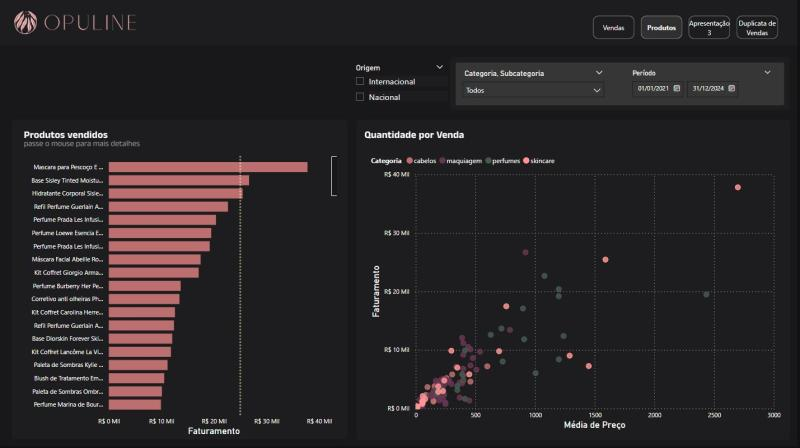
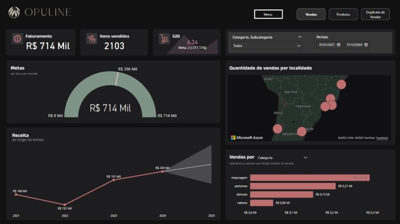

# Projeto-Opuline
 
# Comércio Opuline -  Analise de Dados!

## Descritivo:

Com a finalidade de aprimorar meu conhecimento em Análise de Dados, procurei um curso na Alura que utilizasse dados reais. Com os arquivos CSV do Excel e dados online fornecidos pela Alura, realizei a análise das vendas de um comércio e utilizei DAX para algumas tratativas.
No projeto Opuline, utilizei o Power BI para criar dashboards e elaborar relatórios sobre minhas descobertas nas vendas, além de propor estratégias a serem seguidas.

Durante o desenvolvimento do projeto, fui orientado pelo professor Felipe Amaral.

## Tecnologias:

**Técnicos**: Microsoft Excel · Analise de dados · Microsoft Power BI · DAX (Expressões de análise de dados)

## Gráficos:
**Descrição**: Gráficos gerados a partir dos dados fornecidos, foram tratados e montados via Power BI

**Gráfico 1**: Quantidade de vendas Nacional e Internacional, Total por categoria.

**Gráfico 2**: Meta de venda, Previsão e as vendas por categorias.

